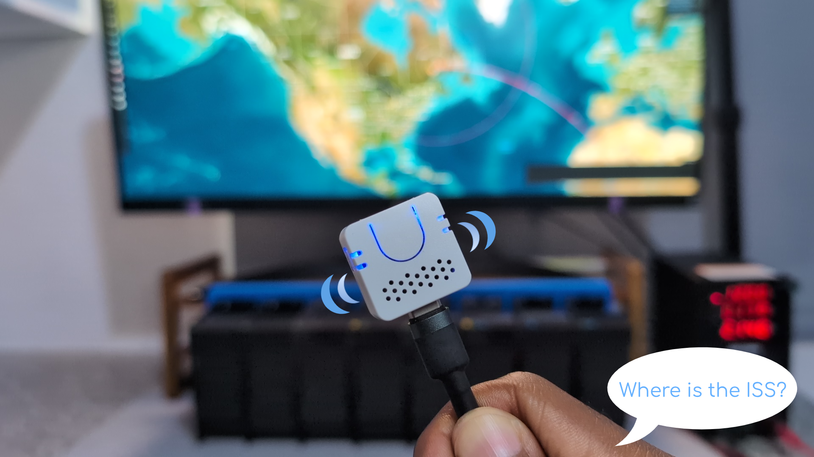

# Voice controlled Split flap display

This repository is forked from this [GitHub repository](https://github.com/rtitmuss/splitflap) by Richard Titmuss who designed the module driver PCB that is compatible with [David Kingsman's split flap project](https://github.com/davidkingsman/split-flap). The code is written in MicroPython, and this repository extends this by adding functionality to display messages, on the 8 module/unit split flap display, sent via an MQTT broker. 

The YouTube video below walks through the process of configuring the split flap display to be voice controlled using M5Stack's Atom Echo with Home Assistant's voice assistant, Assist, by utilizing the Wyoming Protocol, Automations, Custom Sentences MQTT and Home Assistant AI Task integrations. The process of flashing the MicroPython firmware, uploading the code and setting up the various Home Assistant apps and integrations for voice control are also shown in the YouTube video. 

<!-- Change link after we've uploaded it -->
<p align="center">
  <a href="https://youtu.be/Dnaxnct0BiM">
    
  </a>
</p>

This README goes into more technical aspects of the project that were left out in the YouTube video. This includes how to connect and configure the module drivers, determine the polarity of the magnets used by the hall sensors to find the home position, and also how to calibrate the split flap display. The relevant links used in this project can be found in this [section](#reference-links).

## Hardware

Similarly presented in the YouTube video, the following hardware or components are needed for the project:

- Split flap display. This is based on the work of three projects namely,
  - [David Kingsman's split flap](https://github.com/davidkingsman/split-flap) - open sourced his split flap design and provided a detailed instruction manual that walks you through how to build one; this should be your start point 
  - [Dave Lamb's split flap](https://github.com/dmlambo/SplitFlap) - reduced David's design from a 10 module display to an 8 module one, allowing it to be printed on an Ender 3 which I used
  - [Richard Titmuss' split flap](https://github.com/rtitmuss/splitflap) - designed a PCB or module driver, that is compatible with David’s design, which uses a Raspberry Pi Pico instead of an Arduino Nano, and is able to control 4 stepper motors at once
- [M5Stack Atom Echo](https://s.click.aliexpress.com/e/_c3l00gb5) *
- Bench power supply
- Router or mobile device for internet access
- PC to run Home Assistant

The tools or parts used in the project are as follows:

| | Tool/Part |
| --| --|
|1| Soldering iron|
|2| 3D printer|
|3| Wire stripper|
|4| Solder paste|
|5| Solder wire|
|6| [Screwdriver set](https://s.click.aliexpress.com/e/_c3aXCTiz) *|
|7| [Crimping plier tool set](https://s.click.aliexpress.com/e/_c4Ee8LRf)  *|
|8| Hot air rework station/Hot plate preheater|

**- Affiliate link*

## Module driver 

### UART and power connections

The module driver designed by Richard is shown in the labelled image below.

<p align="center">
   
</p>

The bill of materials (BOM) for the PCB is generated from the [module driver project file](/pcb/moduleDriver/moduleDriver.kicad_pro). I used the [JLC PCB Plug-in for KiCAD](https://github.com/bennymeg/Fabrication-Toolkit) to generate the BOM; [KiCAD](https://www.kicad.org/) is a cross platform open source PCB design suite.

Three module drivers were used in this project to control the 8 modules of the display. These drivers communicate with each other using the UART protocol, via female DuPont connectors, plugged into the UART OUT pins of the primary module driver to the UART IN pins of the downstream module driver and so on. The left pin of UART OUT plugs into the left pin of UART IN, the remaining two pins are plugged in accordingly. That is, the wires are not crossed,

| UART OUT pin | UART IN pin |
| ----------- | ------------|
| 1         | 1 |
| 2         | 2 |
| 3         | 3 |

In David's split flap design, the i2C protocol was used to communicate between modules. Additionally, David's PCB is programmed in C, while Richard's module driver is programmed in MicroPython, which is a leaner Python implementation optimized to run on microcontrollers and in constrained environments.

*Note:*
*The PCB silkscreen for the UART pins, INPUT and OUTPUT, were mislabeled in the PCB version I used, they should have been reversed. This was corrected by Richard in the next PCB version, however, I had already had the PCB manufactured before then. The image above does have labels overlayed in the right position on the board.* 

The primary module driver is powered with 12V, from the bench power supply, and is connected in a daisy chain with other drivers to also supply them with 12V. This power connection between modules can be seen below.

<p align="center">
   
</p>

### Hall effect sensor connections

The KY-003 hall effect sensors are used in the project, to find the home position of a module by detecting a 2x1 mm disk neodymium magnet in the drum. This resets the stepper motor steps to zero which allows the Pico to accurately track how far the drum has rotated and what character is shown. The magnets need to be placed in the right direction that lights up the LED as shown below.

<p align="center">
   
</p>

The hall effect sensor pin connections and the respective pin layout on the module driver board are shown in the table below, where the wire colours correspond to the arrangement in the subsequent image. To determine the right side of the magnet, plug in the other end of the connectors into one of the hall sensor pins on the module driver board; the GND pin on the module driver board is on the left.

| Hall Effect Sensor pin | Module driver board pin | Wire colour |
| ----------- | ------------| ------------|
| GND         | GND | Black |
| VCC         | 5V | White |
| S (Signal)  | Sensor A ** | Grey |

***- applicable to hall effect sensors labelled B, C or D*

<p align="center">
   
</p>

After confirming the right side of the magnet, you can use a permanent marker to mark that side of the magnet before placing it inside the drum.

The hall effect sensor signal pins are connected to General Purpose Input Output (GPIO) pins on the Raspberry Pi Pico as seen in the following table.

| Hall Effect Sensor | GPIO pin |
| ----------- | ------------|
| Sensor A         | 14 |
| Sensor B         | 2 |
| Sensor C         | 1 |
| Sensor D         | 15 |

### Complete module driver connections

The stepper motors are plugged into the ports on the module driver board. Similarly, the stepper motor driver pins are connected to GPIO pins on the Pico.

| Stepper Motor | GPIO pins |
| ----------- | ------------|
| Motor A         | 28 27 26 22 |
| Motor B         | 18 19 20 21 |
| Motor C         | 10 11 12 13 |
| Motor D         | 9 8 7 6 |

The figure below shows the back of the split flap display with all the components connected. The Primary module driver controls two modules, the Downstream 1 module driver also controls two modules, and Downstream 2 controls the remaining four modules.

<p align="center">
   
</p>

### `main.py` file configuration

The Primary module driver uses a Raspberry Pi Pico W which has wireless interfaces. This is needed to communicate with the PC via MQTT. The other module drivers downstream use a regular Pi Pico *[highlight]* since they communicate using UART pins. The type of Pico in use has to be specified in the respective [`main.py`](./micropython/main.py) file. For the Primary module, the variable `is_picow` is set to `True` as shown in the [`main.py`](./micropython/main.py) code snippet below.  

```
# primary or downstream panel
is_picow: bool = True
```

While it is set to `False` for the downstream panels. The term ***panel*** represents the module driver which controls a certain number of modules or ***elements***. The panel configuration for the Primary module driver is as follows,

```
# Primary
# panel and element
panel = Panel(
    [
        ElementGpio(15, 9, 8, 7, 6, reverse_direction=True),  # Motor D with Hall sensor D
        ElementGpio(2, 10, 11, 12, 13, reverse_direction=True),  # Motor C with Hall sensor B
        ElementUart(uart_downstream),
    ]
)
```

Suppose the word **HARDWARE** is sent to the Primary module driver via MQTT. From the config above, this panel only controls two modules, so only two characters, **H** and **A**, can be displayed. The first number in the `ElementGpio()` method is the GPIO pin for the [hall effect sensor](#hall-effect-sensor-connections), and the other 4 are GPIO pins for the [stepper motors](#complete-module-driver-connections). If the motor is spinning in the wrong direction, set the `reverse_direction` variable to `False`. 

The remaining 6 characters, **R D W A R E**, are sent to Downstream 1 panel, via the UART protocol, with this line `ElementUart(uart_downstream)`. 

In Downstream 1, the elements are set up in a similar way to control two modules. The characters **R** and **D** are displayed with this panel,

```
# Downstream 1
# panel and element
panel = Panel(
    [
        ElementGpio(15, 9, 8, 7, 6, reverse_direction=True),  # Motor D with Hall sensor D
        ElementGpio(14, 18, 19, 20, 21, reverse_direction=True),  # Motor B with Hall sensor A
        ElementUart(uart_downstream),
    ]
)
```

The remaining 4 characters, **W A R E**, are sent to Downstream 2 with the panel configuration shown in the code snippet below, 

```
# Downstream 2
# panel and element
panel = Panel(
    [
        ElementGpio(2, 28, 27, 26, 22, reverse_direction=True),  # Motor A with Hall sensor B
        ElementGpio(1, 9, 8, 7, 6, reverse_direction=True),  # Motor D with Hall sensor C
        ElementGpio(14, 18, 19, 20, 21, reverse_direction=True),  # Motor B with Hall sensor A
        ElementGpio(15, 10, 11, 12, 13, reverse_direction=True),  # Motor C with Hall sensor D
    ]
)
```

There is no `ElementUart(uart_downstream)` element since all the 8 modules have now been accounted for.

As observed in the previous configurations, differently labelled stepper motors and hall effect sensors can be used together as long as the cables are long enough to plug into the respective module driver.

## Split flap calibration

The drum of the split flap display is connected to a stepper motor which rotates in discrete steps enabling us to have precise and repeatable motion. Each revolution of a stepper motor is divided into an equal number of steps and with this we can create a mapping to the flaps of the display. This means that rotating the motor a certain number of steps will show a particular character. To ensure that the respective module displays the characters we expect, the stepper motors need to be calibrated.

From Richard's python script, [`Calibrate.py`](./micropython/Calibrate.py), which was slightly modified in this repo:

> Each character (e.g., 'A', '3') corresponds to a specific step range on the stepper motor.
> However, mechanical variances cause each flap to "tick" into view at slightly different positions.
> To correct this, we compute an offset per flap by comparing the actual tick-in position with the theoretical one.

### How It Works

As per Richard's script, the calibration process starts out by

- Measuring and recording the step number where each flap
    - *starts showing* the letter `'A'`, and
    - *starts showing* the number `'3'` 
- Then these numbers are compared with their theoretical tick-in positions:
    - `'A'` starts at step 45
    - `'3'` starts at step 1366
- The per-flap error for both `'A'` and `'3'` are computed and
- Finally the per-flap errors are averaged to obtain a robust calibration offset

### Usage Steps

Using the Primary module driver as an example, plug in the two hall effect sensors and stepper motor drivers into ports on the module driver.

In [`Calibrate.py`](./micropython/Calibrate.py), where we define the panel and elements, ensure that this corresponds to the configuration for the Primary panel,

```
# Define panel and element(s)
panel = Panel([
    ElementGpio(15, 9, 8, 7, 6, reverse_direction=True),  # Motor D with Hall sensor D
    #ElementGpio(2, 10, 11, 12, 13, reverse_direction=True),  # Motor C with Hall sensor B
])
```

Notice that the second element is commented out, both elements can be calibrated at the same time, but I preferred to calibrate one element at a time. You can specify the number of elements with the `num_elements` variable in the line below,

```
step = calibrate(panel, num_elements=1)
```

With all this set up, 

- Run the [`Calibrate.py`](./micropython/Calibrate.py) script in Thonny. This script will have to be run multiple times by tweaking the steps until each flap first shows `'A'` and then `'3'`. 

  The step number is manually adjusted with the `step()` function,

  ```
  # Specify number of steps for the stepper motor to run
  step(1520)
  ```

  The table below shows the steps that resulted in showing `'A'` and `'3'` for each module with my setup,

  | Module                     | Steps |  
  | ------------------------ | ----------- | 
  | 1 | A: 35<br>3: 1500       | 
  | 2 | A: 20<br>3: 1479       | 
  | 3 | A: 8<br>3: 1462       | 
  | 4 | A: 13<br>3: 1467       | 
  | 5 | A: 1<br>3: 1469       | 
  | 6 | A: 8<br>3: 1475       | 
  | 7 | A: 11<br>3: 1461       | 
  | 8 | A: 27<br>3: 1506       | 


- Afterwards, fill in the `a_steps` and `three_steps` lists with the steps we obtained in the `calibrate_offsets()` function definition in the [`Calibrate.py`](./micropython/Calibrate.py) script.

  ```
    a_steps = [
        35, 20, 8, 13, 1, 8, 11, 27
    ]

    three_steps = [
        1500, 1479, 1462, 1467, 1469, 1475, 1461, 1506
    ]
  ```

- The calibration offsets are generated by the `calculate_offsets()` function, which is called at the end of the script to generate the `display_offsets` list for each module. 

These offsets are placed in the [Config.py](./micropython/Config.py) file as shown in the code snippet below,

```
# flap offsets in display order for calibration
display_offsets = [-39, -5, -31, -2, -43, -19, -20, 92]
```

Now the split flap display is ready to be used.

## Recommendations

Here are some recommendations or tips for anyone interested in recreating the project:

- Some issues were encountered with the Atom Echo processing some of my commands. I recommend using 
Seeed Studio's [Respeaker Lite](https://s.click.aliexpress.com/e/_c3ZEcu8B) * which is more responsive than the Atom Echo and comes with a louder speaker. However, at the time of writing, customizing your own wakeword is easier to do on the Atom Echo.
- Make sure to have spares of all components, particuarly the motor driver IC, hall effect sensor, Raspberry Pi Pico and stepper motor. I've had to replace each of these at least once.
- Likewise, make sure to print extra flaps, at least 3 for each character. It could be generic filament I used to print the flaps, but I had to replace a number of broken flaps as well.
- This might not be applicable to you, but I had to reprint some of the drums in ABS because the heat from the stepper motor kept melting the friction fit the PLA printed drum had with the stepper motor. A higher temperature resistant filament or a trusted filament brand should rectify this issue.
- If a hall effect sensor works but it is not able to detect the magnet in the drum, try bending the sensor a bit in the appropriate direction until it can detect the magnet.
- I placed some round stickers on components that were faulty, on ones that were newly replaced and on modules that had been calibrated. This way I was able to keep track of the state of some of the modules and also enabled me to rule out certain components when diagnosing hardware problems.

## Acknowledgment

As stated [earlier](#hardware), the project is based on three previous works, but I would like to particularly thank Richard who was
who was very helpful in assisting me solve some issues I had with the code and module driver connections.

## Reference Links

### Split Flap GitHub references
- [David Kingsman's split flap](https://github.com/davidkingsman/split-flap)
- [Dave Lamb's split flap](https://github.com/dmlambo/SplitFlap)
- [Richard Titmuss' split flap](https://github.com/rtitmuss/splitflap)

### Split Flap related
- [The New Haven Solari Board; still kicking](https://www.youtube.com/watch?v=U8azGTsslNc)
- [Split-Flap/Solari Departure Board, Frankfurt Airport 2006](https://www.youtube.com/watch?v=A9RPKbd5vGU)
- [This split flap scoreboard is SO satisfying](https://www.youtube.com/watch?v=K_UEkRFP7fs)
- [Split Flap Display - (3D Printed, Modular, Compact & Enclosed, With Web Interface)](https://www.youtube.com/watch?v=vfplkycYkl8)
- [3D Printed 12 Digit Flap Display](https://www.youtube.com/watch?v=ZvqUX8G5knI)
- [Split flap display Wikipedia](https://en.wikipedia.org/wiki/Split-flap_display)
- [Solar Board Rich History](https://www.oatfoundry.com/blog/solari-board-rich-history/)
- [How a Split-Flap Display Works](https://www.youtube.com/watch?v=UAQJJAQSg_g)
- [A romantic display that you don't see these days.](https://www.youtube.com/watch?v=B5InJ8bYLDM)
- [Oatfoundry](https://www.oatfoundry.com)
- [Vestaboard](https://www.vestaboard.com)

### Stepper motor related
- [What is a Stepper Motor?](https://www.youtube.com/watch?v=fQsdUhRwCU4)
- [Stepper Motors](https://www.omega.co.uk/prodinfo/stepper_motors.html)
- [Stepper Motor: Technology and Applications](https://www.festo.com/gb/en/e/about-festo/blog/in-practice/stepper-motor-technology-and-applications-id_3766930/)
- [Explore the different stepping modes of a stepper motor](https://mechtex.com/blog/explore-the-different-stepping-modes-of-a-stepper-motor)

### MicroPython related
- [MicroPython Docs](https://docs.micropython.org/en/latest/)
- [MicroPython firmware for RPi Pico W](https://micropython.org/download/RPI_PICO_W/)
- [MicroPython firmware for RPi Pico](https://micropython.org/download/RPI_PICO/)
- [Thonny](https://thonny.org/)

 ### Home Assistant related
- [Home Assistant](https://www.home-assistant.io/)
- [Home Assistant Installation](https://www.home-assistant.io/installation/)
- [Talking with Home Assistant - get your system up & running](https://www.home-assistant.io/voice_control/)
- [Getting started - Local](https://www.home-assistant.io/voice_control/voice_remote_local_assistant)
- [Wyoming Protocol](https://www.home-assistant.io/integrations/wyoming/)
- [Wake words for Assist](https://www.home-assistant.io/voice_control/create_wake_word/)
- [Wake word model training notebook](https://colab.research.google.com/drive/1q1oe2zOyZp7UsB3jJiQ1IFn8z5YfjwEb?usp=sharing#scrollTo=1cbqBebHXjFD)
- [$13 voice assistant for Home Assistant](https://www.home-assistant.io/voice_control/thirteen-usd-voice-remote/)
- [Automating Home Assistant ](https://www.home-assistant.io/docs/automation/)
- [Adding a custom sentence to trigger an automation](https://www.home-assistant.io/voice_control/custom_sentences/)
- [LOCAL VOICE CONTROL using the Seeed Studio ReSpeaker Lite Voice Assistant Kit](https://www.youtube.com/watch?v=k1eo25SAq9M)
- [Ollama Integration](https://www.home-assistant.io/integrations/ollama/)
- [Google Gemini Integration](https://www.home-assistant.io/integrations/google_generative_ai_conversation/)

### MQTT related
- [Eclipse Mosquitto](https://github.com/eclipse-mosquitto/mosquitto)
- [HiveMQ](https://www.hivemq.com/mqtt/)
- [HiveMQ MQTT Essentials playlist](https://www.youtube.com/playlist?list=PLRkdoPznE1EMXLW6XoYLGd4uUaB6wB0wd)
- [MQTT Basics: What is MQTT and How Does it Work?](https://www.youtube.com/watch?v=z4r4hIZcp40&t=14s)
- [umqtt simple](https://mpython.readthedocs.io/en/v2.2.1/library/mPython/umqtt.simple.html)

 ### ISS related
- [International Space Station](https://www.earthdata.nasa.gov/data/platforms/space-based-platforms/iss)
- [International Space Station Reference](https://www.nasa.gov/reference/international-space-station/)
- [ISS Tracker](https://isstracker.pl/en?satId=25544)
- [ISS Stock Video](https://pixabay.com/videos/international-space-station-nasa-iss-238/)
- [NASA's Livestreams](https://www.youtube.com/@NASA/streams)
- [Space Station Orbit Tutorial](https://eol.jsc.nasa.gov/Tools/orbitTutorial.htm)
- [Open Notify API for Current Location of ISS](http://open-notify.org/Open-Notify-API/ISS-Location-Now/)
- [Spot the Station Frequently Asked Questions](https://www.nasa.gov/missions/station/spot-the-station-frequently-asked-questions/)
- [ISS Python Tracking Code Reference](https://www.tutorialspoint.com/how-to-track-iss-international-space-station-using-python)

### LocationIQ
- [LocationIQ](https://locationiq.com/)
- [LocationIQ Reverse API](https://docs.locationiq.com/reference/reverse-api)

### Misc
- [Raspberry Pico microcontroller boards](https://www.raspberrypi.com/documentation/microcontrollers/pico-series.html#pico-1-family)
- [I made a real BMO local AI agent with a Raspberry Pi and Ollama](https://www.youtube.com/watch?v=l5ggH-YhuAw)
- [ATOM Echo Smart Speaker Development Kit](https://shop.m5stack.com/products/atom-echo-smart-speaker-dev-kit)
- [Seeed Studio reSpeaker Lite](https://www.seeedstudio.com/ReSpeaker-Lite-p-5928.html)
- [Angry IP Scanner](https://angryip.org/)
- [PROTOCOLS: UART - I2C - SPI - Serial communications #001](https://www.youtube.com/watch?v=IyGwvGzrqp8)
- [Understanding UART](https://www.youtube.com/watch?v=sTHckUyxwp8)
- [Understanding I2C](https://www.youtube.com/watch?v=CAvawEcxoPU)
